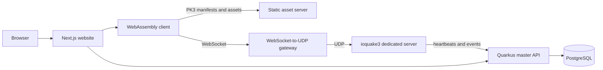

<p align="center">
  <a href="https://q3js.com">
    <picture>
      <source media="(prefers-color-scheme: dark)" srcset="https://shieldcn.dev/header/grid.svg?title=Q3JS&amp;subtitle=Quake+III+Arena+in+the+browser&amp;logo=data%3Aimage%2Fsvg%2Bxml%3Bbase64%2CPHN2ZyB4bWxucz0iaHR0cDovL3d3dy53My5vcmcvMjAwMC9zdmciIHZpZXdCb3g9IjAgMCA4OCAzMiI%2BCiAgPCEtLQogICAgU2hpZWxkY24gZml0cyBjdXN0b20gcGF0aCBsb2dvcyBieSB0aGVpciB2aWV3Qm94IGFuZCBzdHJpcHMgU1ZHIHRyYW5zZm9ybXMuCiAgICBUaGVzZSBwYXRocyBhcmUgb2Zmc2V0IGFyb3VuZCB0aGUgc21hbGxlciB2aWV3Qm94IHNvIHRoZSBjb21wb3NpdGUgcmVuZGVycwogICAgYXQgdHdpY2UgdGhlIG5vcm1hbCBsb2dvLXNsb3Qgc2l6ZSB3aGlsZSByZW1haW5pbmcgdmlzdWFsbHkgY2VudGVyZWQuCiAgLS0%2BCiAgPHBhdGggZD0iTS05LjQ2MTM3NCAxNi4wOTAyNjUtMTEuNDYxMzczIDQ4bC0yLjAwMDAwMS0zMkwtMTEuNDYxMzczLTE2bDEuOTk5OTk5IDMyLjA5MDI2NXoiIC8%2BCiAgPHBhdGggZD0ibS0xNS45NDA0MzggNDMtMi40NDcyODEtMjQuOTYzMzIzUy00MS44NzE4MjI1IDE1LjIxODE5OS00MS45OTg5MjM1IDkuMDY0NTYxYy0uMDg1NDg0LTQuMDQ3NTY0IDQuOTQxMDUtNS45NjkzNDYgNy42OTM1MjQtNS45NjkzNDYgMi4zMDYxMjEgMC01LjQ4NjM4MS4wNDgyNDktNS41MjMyMzMgNS4xOTE4NTgtLjAzMDgyIDQuMzkyODQgMjUuMTg4NTMyIDYuMDU5ODkgMjUuMTg4NTMyIDYuMDU5ODlMLTE1Ljk0MDQzOCA0M3oiIC8%2BCiAgPHBhdGggZD0ibS03LjA1OTU2MiA0MyAyLjQ0NzI4MS0yNC45NjMzMjNzMjMuNDg0MTA0LTIuODE4NDc4IDIzLjYxMTIwNS04Ljk3MjExNmMuMDg1NDg0LTQuMDQ3NTY0LTQuOTQxMDUxLTUuOTY5MzQ2LTcuNjkzNTI1LTUuOTY5MzQ2LTIuMzA2MTIgMCA1LjQ4NjM4MS4wNDgyNDkgNS41MjMyMzMgNS4xOTE4NTguMDMwODIgNC4zOTI4NC0yNS4xODg1MzIgNi4wNTk4OS0yNS4xODg1MzIgNi4wNTk4OUwtNy4wNTk1NjIgNDN6IiAvPgogIDxwYXRoIGQ9Ik0zNiAxMmg2VjZoNHY2aDZ2NGgtNnY2aC00di02aC02eiIgLz4KICA8cGF0aCBkPSJNMTA3LjMyLTE2di4zNDRhNy4zMzkgNy4zMzkgMCAwIDEtMTQuNjc3IDBWLTE2SDY4djY0aDY0di02NGgtMjQuNjh6bS04Ljc3NiA1Ny4xNDktMy4xMTctMTUuNDIxaC0uMDUzbC0zLjM3MSAxNS40MjFoLTQuMjk2bC00Ljg2NC0yMi42NTloNC4yNGwyLjkwMSAxNS40MjFoLjA1M2wzLjQ5Ni0xNS40MjFoMy45NjVsMy4xMzkgMTUuNjExaC4wNTNsMy4zMTItMTUuNjExaDQuMTYzbC01LjQwNSAyMi42NTloLTQuMjE2em0yMy4zNDcgMC0xLjQ0NS01LjA0M2gtNy42MjlsLTEuMTEyIDUuMDQzaC00LjI0bDUuNDgzLTIyLjY1OWg2LjY5MWw2LjY2NyAyMi42NTloLTQuNDEzem0tNi4zOTItMTcuMDc1LTEuODUxIDguMzE1aDUuNzU3bC0yLjEyMy04LjMxNWgtMS43ODR6IiAvPgo8L3N2Zz4K&amp;logoColor=d94a36&amp;align=center&amp;accent=d94a36&amp;font=jetbrains-mono&amp;radius=0&amp;mode=dark" />
      
    </picture>
  </a>
</p>

<p align="center">
  A multiplayer Quake III Arena experience for the modern web, built on ioquake3 and WebAssembly.
</p>

<p align="center">
  <a href="https://q3js.com">
    <picture>
      <source media="(prefers-color-scheme: dark)" srcset="https://shieldcn.dev/badge/play-q3js.com-d94a36.svg?variant=branded&amp;logo=googlechrome&amp;font=jetbrains-mono&amp;radius=0&amp;mode=dark" />
      
    </picture>
  </a>
  <a href="https://discord.com/invite/mKvM9su443">
    <picture>
      <source media="(prefers-color-scheme: dark)" srcset="https://shieldcn.dev/discord/members/mKvM9su443.svg?variant=outline&amp;color=d94a36&amp;font=jetbrains-mono&amp;radius=0&amp;mode=dark" />
      
    </picture>
  </a>
  <a href="https://github.com/lklacar/q3js/stargazers">
    <picture>
      <source media="(prefers-color-scheme: dark)" srcset="https://shieldcn.dev/github/stars/lklacar/q3js.svg?variant=outline&amp;color=d94a36&amp;font=jetbrains-mono&amp;radius=0&amp;mode=dark" />
      
    </picture>
  </a>
  <a href="https://github.com/lklacar/q3js/commits/develop">
    <picture>
      <source media="(prefers-color-scheme: dark)" srcset="https://shieldcn.dev/github/last-commit/lklacar/q3js.svg?variant=outline&amp;color=d94a36&amp;font=jetbrains-mono&amp;radius=0&amp;mode=dark" />
      
    </picture>
  </a>
  <a href="https://github.com/lklacar/q3js/graphs/contributors">
    <picture>
      <source media="(prefers-color-scheme: dark)" srcset="https://shieldcn.dev/github/contributors/lklacar/q3js.svg?variant=outline&amp;color=d94a36&amp;font=jetbrains-mono&amp;radius=0&amp;mode=dark" />
      
    </picture>
  </a>
  <a href="https://github.com/lklacar/q3js/blob/develop/LICENSE">
    <picture>
      <source media="(prefers-color-scheme: dark)" srcset="https://shieldcn.dev/badge/license-mixed-d94a36.svg?variant=outline&amp;font=jetbrains-mono&amp;radius=0&amp;mode=dark" />
      
    </picture>
  </a>
</p>

Q3JS brings the ioquake3 engine to the browser and surrounds it with everything needed for an online game: a framework-independent WebAssembly client, packaged dedicated servers, a WebSocket-to-UDP gateway, live server discovery, player statistics, and a responsive web interface.

> [!IMPORTANT]
> Q3JS does not include or download proprietary Quake III Arena game data. You must provide your own legally obtained PK3 files.

## Architecture



| Component | Purpose | Stack | Documentation |
| --- | --- | --- | --- |
| `website/` | Server browser, player profiles, scoreboards, and game launcher | Next.js, React, Tailwind CSS | [Website guide](website/README.md) |
| `game/client/` | Browser runtime, virtual filesystem, asset loading, persistence, and mobile input | TypeScript, Emscripten, WebAssembly | [Client guide](game/client/README.md) |
| `game/server/` | Dedicated server package and WebSocket-to-UDP gateway | ioquake3, Node.js, TypeScript | [Server guide](game/server/README.md) |
| `master/` | Server registry, event ingestion, profiles, scoreboards, statistics, and GeoIP | Java 17, Quarkus, jOOQ, Flyway | [Master guide](master/README.md) |
| `static/` | Safe, cacheable PK3 and manifest delivery | nginx, shell | [Static server guide](static/README.md) |

## Features

- Native ioquake3 gameplay compiled to WebAssembly with the OpenGL 2 renderer.
- Browser-to-server play through a WebSocket-to-UDP gateway.
- Live community and official server discovery with health-aware heartbeats.
- Global frag rankings, activity distribution, player profiles, rivals, maps, and weapon statistics.
- Multi-mod asset manifests with persistent browser-side caching.
- Country lookup and in-game country metadata.
- OpenAPI-generated website client and Swagger UI for the master API.
- Container images for every deployable service.

## Prerequisites

- Node.js 24 and [pnpm](https://pnpm.io/) 11.2.2
- Java 17 for the master server
- Docker with Compose for PostgreSQL and the static asset server
- Emscripten SDK 6.0.5, CMake, and Ninja to build the browser client
- A C/C++ toolchain and `zip` to build the dedicated server
- Legally obtained Quake III Arena data, arranged as `baseq3/pak0.pk3` through `baseq3/pak8.pk3`

The container builds pin the toolchain versions used by the project and are the best reference when setting up a local environment.

## Quick start

Clone the repository and install the workspace dependencies:

```bash
git clone https://github.com/lklacar/q3js.git
cd q3js
pnpm install --frozen-lockfile
```

Build the WebAssembly client:

```bash
make client
```

Create the website's local configuration:

```bash
cp website/.env.example website/.env.local
```

Set `NEXT_PUBLIC_Q3JS_STATIC_URL=http://localhost:8081` in `website/.env.local`. Then start the stack in separate terminals from the repository root:

```bash
# Terminal 1 — PostgreSQL
docker compose up -d database

# Terminal 2 — master API
make master-run

# Terminal 3 — game server and WebSocket gateway
export Q3JS_DATA_DIR=/absolute/path/to/quake3-data
Q3JS_BASEPATH="$Q3JS_DATA_DIR" make server-run

# Terminal 4 — PK3 and manifest server
export Q3JS_DATA_DIR=/absolute/path/to/quake3-data
docker build -f static/Dockerfile -t q3js-static .
docker run --rm -p 8081:8080 -v "$Q3JS_DATA_DIR:/data:ro" q3js-static

# Terminal 5 — website
pnpm --dir website dev
```

Open [http://localhost:3000](http://localhost:3000). The local game server publishes its gateway at `ws://localhost:27961/ws` and registers itself with the master automatically.

### Local ports

| Port | Protocol | Service |
| --- | --- | --- |
| `3000` | HTTP | Website |
| `5432` | TCP | PostgreSQL |
| `8080` | HTTP | Master API and Swagger UI |
| `8081` | HTTP | Local static asset server |
| `27960` | UDP | Quake III dedicated server |
| `27961` | HTTP / WebSocket | Gateway and health endpoint |

## Common commands

| Command | Description |
| --- | --- |
| `make client` | Build the ioquake3 WebAssembly runtime and `@q3js/client` |
| `make server` | Build the native dedicated server, game QVMs, and gateway package |
| `make server-run` | Build and run the packaged game server |
| `make master` | Build the Quarkus master application |
| `make master-run` | Run the master API in Quarkus development mode |
| `make website` | Build the browser client and production website |
| `pnpm --dir website dev` | Run the website development server |

## Configuration

Each component documents its complete configuration surface. These variables connect the services in a typical deployment:

| Variable | Used by | Purpose |
| --- | --- | --- |
| `NEXT_PUBLIC_Q3JS_MASTER_URL` | Website/browser | Public master API origin |
| `Q3JS_MASTER_URL` | Website/server | Server-reachable master API origin |
| `NEXT_PUBLIC_Q3JS_STATIC_URL` | Website/browser | Public PK3 manifest and asset origin |
| `Q3JS_BASEPATH` | Game server | Directory containing game and mod data folders |
| `Q3JS_EVENT_CLIENT_SECRET` | Master/game server | Shared secret for authenticated events and official heartbeats |
| `Q3JS_PUBLISH_HOST` / `Q3JS_PUBLISH_PORT` | Game server | Browser-reachable gateway address |
| `Q3JS_SECURE` | Game server | Publish the gateway with `wss` instead of `ws` |
| `Q3JS_DB_URL` / `Q3JS_DB_USER` / `Q3JS_DB_PASSWORD` | Master | PostgreSQL connection settings |

Generate a production event secret with `openssl rand -hex 32` and provide the same value to the master and each official game server. Never use the development fallback in production.

## Checks

Run the component checks from the repository root:

```bash
pnpm --dir game/client typecheck
pnpm --dir game/server test
./master/mvnw -f master/pom.xml test
pnpm --dir website lint
sh static/test/generate-manifests.test.sh
```

Production builds are available through `make client`, `make server`, `make master`, and `make website`.

## Deployment

Production Dockerfiles live beside their services:

- `website/Dockerfile` builds the WebAssembly client and standalone Next.js server.
- `master/Dockerfile` builds the Quarkus API on Java 17.
- `game/server/Dockerfile` packages ioquake3, the game QVMs, and the gateway.
- `static/Dockerfile` serves mounted game data without embedding it in the image.

The website's `NEXT_PUBLIC_*` values are compiled into the browser bundle, so provide production values as Docker build arguments. Detailed image examples and runtime variables are available in the component guides above.

## Game data and mods

Mount one data directory with a subdirectory for every Quake filesystem game name:

```text
quake3-data/
├── baseq3/
│   ├── pak0.pk3
│   └── ...
├── cpma/
│   └── z-cpma-pak153.pk3
└── osp/
    └── osp-pak0.pk3
```

The static server generates `/<game>/manifest.json` at startup and exposes only safe PK3 paths. Restart it after changing the mounted data so the manifests are regenerated.

## API

With the master running locally:

- Swagger UI: [http://localhost:8080/q/swagger-ui](http://localhost:8080/q/swagger-ui)
- OpenAPI document: [http://localhost:8080/q/openapi](http://localhost:8080/q/openapi)
- Health checks: [http://localhost:8080/q/health](http://localhost:8080/q/health)

The website's typed API and TanStack Query helpers are generated from this OpenAPI document. See the [website guide](website/README.md#master-api-client) before changing generated code.

## License

This repository uses multiple licenses. The ioquake3-derived engine in `game/engine/` is licensed under **GPL-2.0-only**. The Q3JS client, server, master, static server, website, and repository-level integration code are **proprietary; all rights reserved**. The bundled DB-IP Country Lite database is licensed under **CC BY 4.0**.

See [LICENSE](LICENSE) and [NOTICE](NOTICE) for the authoritative terms and required attributions. Quake III Arena game data is not included, and Q3JS is not affiliated with or endorsed by id Software or ZeniMax Media.

<p align="center">
  Built with <a href="https://ioquake3.org/">ioquake3</a> · Play at <a href="https://q3js.com">q3js.com</a> · README visuals by <a href="https://shieldcn.dev">shieldcn</a>
</p>
